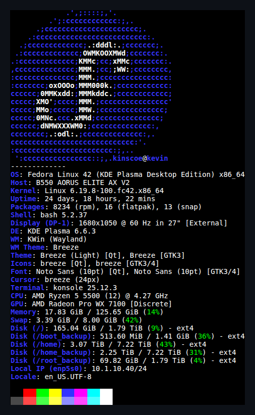
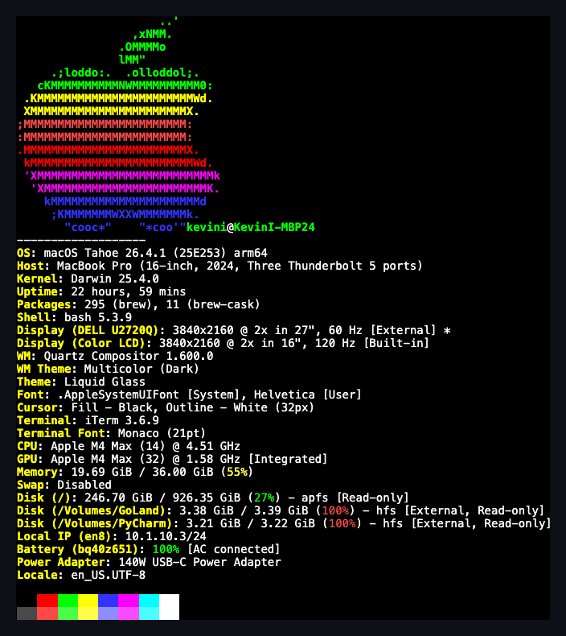
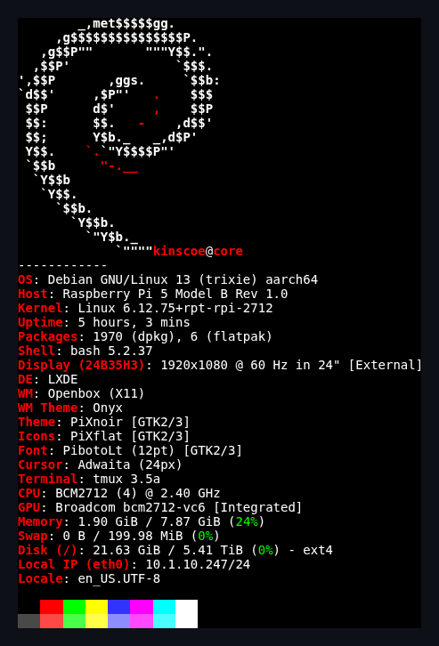

# Dotfiles

Personal Bash, Vim, cheat, and VS Code configuration for macOS, Fedora, and Raspberry Pi (Debian) hosts.

Dotfiles are managed with [GNU Stow](https://www.gnu.org/software/stow/). `install.sh` creates symlinks in `$HOME` rather than copying files, so edits to files in your home directory are immediately reflected in the repo.

## Quick Start

Install stow first (`apt install stow` / `brew install stow` / `dnf install stow`).

**First time on a host that previously used the old copy-based setup:**
```bash
bash migrate-to-stow.sh   # removes old copies so stow can create symlinks
bash install.sh
bash restore.sh           # optional, restores VS Code settings
```

**Fresh host:**
```bash
bash install.sh
bash restore.sh           # optional, restores VS Code settings
```

Use `copy.sh` only to capture VS Code settings from a live machine back into this repo. All other config (shell, vim, cheat) is live via symlinks — just edit in place.

## Repository Layout

Stow packages map directly to `$HOME`. Each top-level directory is a package:

- `bash/` — `.bashrc`, `.bash_profile`, macOS zsh files, and numbered fragments in `bash/.bash.d/`
- `vim/` — `.vimrc` and `.vim/` runtime files
  - `.vim/colors/` — custom colorschemes: `kevin.vim` (general dark), `kevin_perl.vim` (Perl/shell/Go/Python), `kevin_markdown.vim` (Markdown), plus third-party `af.vim` and `ir_black.vim`
  - `.vim/myfiletypes.vim` — filetype autocmds; maps non-standard extensions and assigns per-filetype colorschemes
- `aspell/` — `.aspell.en.pws` personal dictionary
- `cspell/` — `.cspell.json` global cspell config (auto-discovered from `~/`) and `~/.config/cspell/custom-words.txt` personal word list
- `cheat/` — `cheat` CLI config (`~/.config/cheat/conf.yml`)
- `home/` — everything that stows into `~/` but doesn't fit a dedicated package (e.g. `~/cheats/`)
- `tmux/` — `.tmux.conf` and `~/.config/tmux/status/` scripts (workingon, git, aws, k8s); shared across platforms
- `opensessions/` — `~/.config/opensessions/config.json` (opensessions tmux sidebar config: sidebar position, width, theme)
- `git/` — `.gitconfig` (global git config) and `~/.config/git/` (global ignore, global hooks); shared across platforms
- `ghostty-fedora/` — Ghostty terminal config for Fedora (absolute tmux path)
- `ghostty-mac/` — Ghostty terminal config for macOS (Homebrew tmux path)
- `ghostty-debian/` — Ghostty terminal config for Raspberry Pi / Debian (built from source)
- `vscode/` — host-specific VS Code settings snapshots (not stowed; restored via `restore.sh`)
- [`Brewfile/`](Brewfile/RUNBOOK.md) — Homebrew manifest (taps, formulae, casks, VS Code extensions) for bootstrapping a Mac via `brew bundle install`; not stowed
- `desktop-setup/` — platform-specific setup guides, runbooks, and GUI app documentation
  - [`fedora-kde/`](desktop-setup/fedora-kde/) — Fedora KDE Plasma setup (including [Claude Desktop](desktop-setup/fedora-kde/claude-desktop/README.md))
  - `MacOS/` — macOS fastfetch config
  - [`application-runbooks/`](desktop-setup/application-runbooks/README.md) — per-app operational notes for desktop applications (Ghostty, MarkText, Obsidian, Typora, git/gitsign, tmux)

## Stow folding — why some symlinks are on directories, not files

Stow always folds as high as it can. If the target directory doesn't exist in `$HOME` before stow runs, stow symlinks the whole directory in one go rather than creating a symlink per file inside it. For example, `~/.bash.d/` didn't exist before stow first ran, so stow made `~/.bash.d` a single directory symlink → `.dotfiles/bash/.bash.d/` instead of 24 individual file symlinks.

Consequence: `ls -la ~/.bash.d/somefile` follows the directory symlink and shows a regular file with no `l` prefix or `->` target — it's the underlying real file in the repo. Don't mistake this for "not stowed". Check `readlink ~/.bash.d` or `ls -la ~ | grep bash.d` to see the directory symlink itself.

If stow needs to merge new files into an existing real `$HOME` subdirectory, it "unfolds" — breaks the directory symlink and creates per-file symlinks inside. Both behaviors produce the same end result (edits in `~/.dotfiles/…` are live), but the on-disk layout differs.

## Workflow

- `bash install.sh` — stows all packages (creates symlinks in `$HOME`)
- `bash restore.sh` — restores VS Code settings after `install.sh`
- `bash copy.sh` — copies VS Code config from the live system back into this repo

`restore.sh` contains hostname-specific logic. If you are adapting this repo for another system, update it before use.

## Private Local Dependencies

Some shell fragments expect files that are intentionally not tracked here:

- `~/bin/` for personal helper scripts such as prompt and completion helpers; also expects `~/bin/gitme/` (clone of [davorg/gitme](https://github.com/davorg/gitme)) for quick git repo jumping
- `~/.environment/` for machine-specific environment variables, aliases, and secrets

This repository is public-safe only if secrets and private tooling remain outside version control.

## Notes for Public Use

This repo is primarily a personal setup, not a generic dotfiles framework. Use it as a reference or starting point, and expect to change paths, hostnames, and tool-specific assumptions for your own environment.

## Fedora desktop



## macOS desktop



## Raspberry Pi 5



## Raspberry Pi (Debian Trixie, aarch64)

Raspberry Pi 5 running Debian Trixie with a display attached. Ghostty is built from source (no official arm64 `.deb` exists). `install.sh` detects Debian via `/etc/os-release` and stows the `ghostty-debian` package automatically.

**Packages stowed:** `bash`, `vim`, `aspell`, `cheat`, `home`, `tmux`, `git`, `ghostty-debian`.

**tmux auto-attach on SSH login** is in `.bashrc` — no extra setup needed after `install.sh`.

**First-time setup on a fresh Pi:**
```bash
sudo apt install stow git tmux pkg-config gettext libxml2-utils \
  libgtk-4-dev libadwaita-1-dev libgtk4-layer-shell-dev

# zig 0.15.2 — required to build Ghostty 1.3.x
# Add griffo.io repo first (provides zig-0):
curl -sS https://debian.griffo.io/EA0F721D231FDD3A0A17B9AC7808B4DD62C41256.asc \
  | sudo gpg --dearmor --yes -o /etc/apt/trusted.gpg.d/debian.griffo.io.gpg
echo "deb https://debian.griffo.io/apt $(lsb_release -sc) main" \
  | sudo tee /etc/apt/sources.list.d/debian.griffo.io.list
sudo apt update && sudo apt install -y zig-0

# Build Ghostty 1.3.0 from source (~5 min on Pi 5)
curl -L -o /tmp/ghostty-1.3.0.tar.gz \
  https://release.files.ghostty.org/1.3.0/ghostty-1.3.0.tar.gz
tar xzf /tmp/ghostty-1.3.0.tar.gz -C /tmp
cd /tmp/ghostty-1.3.0
/usr/lib/zig/0.15.2/zig build -Doptimize=ReleaseFast -p ~/.local
# Binary lands at ~/.local/bin/ghostty

# Clone and apply dotfiles
git clone git@github.com:kevinpinscoe/dotfiles.git ~/.dotfiles
cd ~/.dotfiles
bash install.sh
# Install tpm for tmux plugins
git clone https://github.com/tmux-plugins/tpm ~/.tmux/plugins/tpm
```

**If migrating a Pi that was previously set up with the old copy-based deploy-debian.sh:**
```bash
# Remove the real (non-symlinked) files so stow can take over
rm -rf ~/.bash.d ~/.tmux.conf ~/.config/tmux/status/*.sh
cd ~/.dotfiles
bash install.sh
```

`install.sh` automatically repairs a stow-folded `~/.config/git` directory symlink (converts it to per-file symlinks so git can write runtime files alongside tracked config). No manual cleanup needed for the git package.

